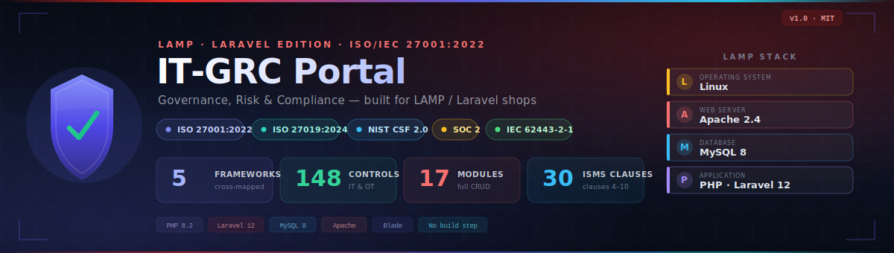
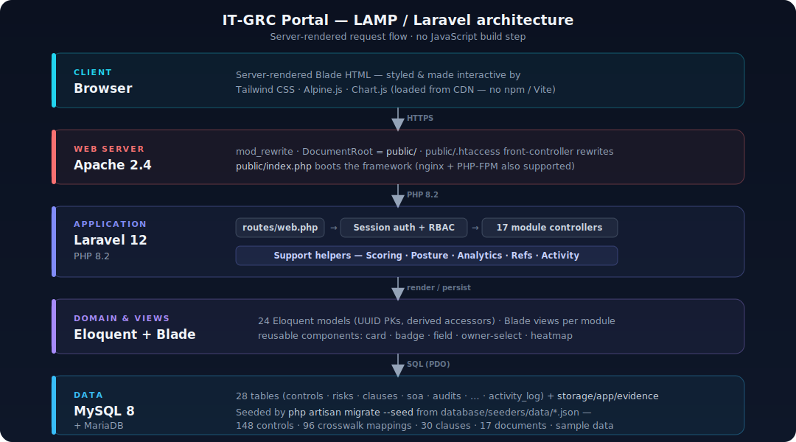

<p align="center">
  
</p>

# IT-GRC Portal — LAMP / Laravel Edition

[](https://php.net)
[](https://laravel.com)
[](https://mysql.com)
[](https://httpd.apache.org)
[](LICENSE)
[](https://github.com/Krishcalin/IT-GRC-LAMP-Stack/actions/workflows/ci.yml)

A **comprehensive open-source IT Governance, Risk & Compliance (GRC) portal** for managing an
organization's **ISO/IEC 27001:2022** ISMS — built on the **LAMP stack with Laravel** so teams
standardized on **Linux · Apache · MySQL · PHP/Laravel** can self-host it natively.

It is a faithful re-implementation of the original
[IT-GRC portal](https://github.com/Krishcalin/IT-GRC) (FastAPI + React + PostgreSQL) — same data
model, frameworks, control catalogs and capabilities — re-expressed as a single idiomatic Laravel
application with **server-rendered Blade views** and **no JavaScript build step** (Tailwind, Alpine
and Chart.js are loaded from a CDN), so it deploys to any PHP host.

---

## Table of contents

- [Why a LAMP edition?](#why-a-lamp-edition)
- [Feature overview](#feature-overview)
- [Frameworks & control coverage](#frameworks--control-coverage)
- [Architecture](#architecture)
- [Requirements](#requirements)
- [Quick start with Docker](#quick-start-with-docker)
- [Manual installation on a LAMP host](#manual-installation-on-a-lamp-host)
- [Configuration reference (`.env`)](#configuration-reference-env)
- [Production hosting](#production-hosting)
- [First login & seeded data](#first-login--seeded-data)
- [Routes](#routes)
- [Roles & access control](#roles--access-control)
- [Project structure](#project-structure)
- [Testing & CI](#testing--ci)
- [Maintenance & upgrades](#maintenance--upgrades)
- [Troubleshooting](#troubleshooting)
- [License & disclaimer](#license--disclaimer)

---

## Why a LAMP edition?

The original portal is a decoupled Python API + React SPA on PostgreSQL. Many enterprises run a
**LAMP** standard and a Laravel application platform. This edition delivers the identical GRC
capability as a single Laravel app that drops into that environment:

| | Original | LAMP Edition (this repo) |
|---|----------|--------------------------|
| Backend | Python 3.12 + FastAPI | **PHP 8.2 + Laravel 12** |
| Frontend | React 18 + TypeScript (SPA) | **Blade + Tailwind (server-rendered)** |
| Database | PostgreSQL 16 | **MySQL 8 / MariaDB 10.6+** |
| Web server | Uvicorn | **Apache 2.4** (or nginx + PHP-FPM) |
| Migrations | Alembic | **Laravel migrations** |
| Front-end build | Vite / npm | **none** — Tailwind/Alpine/Chart.js via CDN |
| Auth | JWT | **Server-side sessions** |

---

## Feature overview

Every module from the original is implemented. All pages are server-rendered Blade with filtering,
full CRUD, role-based access, auto-generated reference IDs (`RISK-001`, `DOC-014`, …) and an
activity log on every create/update/delete.

### Dashboard & analytics
- **Executive dashboard** with live posture cards — **Compliance**, **ISMS Conformity**,
  **Document Readiness** and **Training Completion** percentages (progress bars) plus headline
  counts (implemented controls, open/critical risks, open findings, open/overdue tasks).
- **Charts** (Chart.js): controls-by-status doughnut and Annex-A-by-theme bar.
- **Risk heat map** — 5×5 likelihood × impact matrix with per-cell counts and severity colouring.
- **ISMS posture trend** — compliance / conformity / readiness / training tracked over time; a
  snapshot is captured automatically once per day when the dashboard loads (no scheduler required).
- **"My Work"** panel — the signed-in user's open/overdue tasks, pending approvals, owned
  controls/risks and assigned findings.
- **Open incidents** and **recent activity** feeds.

### Controls library & unified framework crosswalk
- **148 controls across 5 frameworks** pre-loaded: ISO/IEC 27001:2022 Annex A (93), ISO/IEC
  27019:2024 energy/OT "ENR" (12), NIST CSF 2.0 (22 categories), SOC 2 (13 criteria) and
  ISA/IEC 62443-2-1:2024 (8 OT Security Program Elements).
- Filter by **framework, theme and status**; track implementation status, owner and review date.
- **Control-to-control crosswalk** — map a control to equivalent / related / broader / narrower
  controls in other frameworks ("test once, comply many"), editable on each control's detail page,
  shown in both directions.
- **96 starter mappings** seeded (ISO 27001 ↔ NIST CSF / SOC 2, and ISO 27001/27019 ↔ IEC 62443).
- **Frameworks page** — per-framework control counts and a **cross-framework coverage matrix**.

### Statement of Applicability (SoA)
- One entry per control: applicable / not applicable with justification.
- Implementation status (Not Implemented → Partially → Fully → N/A), responsible person, evidence
  notes. Drives the dashboard compliance score.

### ISMS clause conformity (Clauses 4–10)
- All **30 mandatory management-system requirements** pre-loaded, grouped by section (Context,
  Leadership, Planning, Support, Operation, Performance evaluation, Improvement).
- Track conformity (Not Assessed → In Progress → Partially Conformant → Conformant / Nonconformant),
  owner and review date; each clause flags the mandatory documented information it requires.

### Documented information register (Clause 7.5)
- **17 mandatory documents/records** pre-loaded as a checklist linked to their clauses.
- Controlled-document lifecycle: type, version, classification, owner/approver, status
  (Draft → Under Review → Approved → Retired) and review dates. Feeds the document-readiness score.

### Risk register
- Full lifecycle risks with a **5×5 inherent and residual** likelihood × impact matrix; level
  (Low/Medium/High/Critical) auto-computed.
- Treatment options (Mitigate / Accept / Transfer / Avoid), treatment plan, owner, review date.
- Link risks to controls (and assets).

### Assessments & attestations
- **Control self-assessments** with CMMI-style **maturity scoring (0–5)** and a derived score.
- **Vendor security questionnaires** (Yes/No/Partial) with a derived compliance score, linkable to
  a supplier.
- **One-click "populate from framework"** generates an item per control in a chosen framework.
- Per-assessment score, average maturity and progress; status workflow (Draft → In Progress →
  Submitted → Reviewed → Closed).
- **Policy acknowledgment / attestation** via the Policies module.

### Workflow tasks & approvals
- Cross-cutting task layer any record can route work to — Action / Review / Remediation / **Approval**.
- Filters by status, type, priority, assignee and **overdue**; due-date SLA flagging.
- **Approval tasks** capture an Approved/Rejected decision, the decider and a timestamp — an
  audit-tracked sign-off recorded inline from the task board.

### Suppliers / third parties (Clauses 5.19–5.23)
- Category (Product / Service / ICT Supply Chain / Cloud Service), criticality, data classification
  and status; flags for IS-requirements-agreed, right-to-audit and PII processing; certifications
  and contract/review dates.

### Incident management (Clauses 5.24–5.28)
- Category, severity and lifecycle status (New → Triaged → In Progress → Resolved → Closed);
  containment, root cause, lessons learned and evidence notes; data-breach flag; auto resolution
  timestamp; optional link to a risk.

### Awareness & training (Clauses 7.2 / 7.3)
- Campaigns (type, topic, audience, materials, dates) with per-participant completion records and an
  auto-computed completion rate.

### Audits & findings
- Internal / external / surveillance audits with scope and conclusion; findings (Major NC / Minor
  NC / Observation / OFI) with severity, corrective action, due date, assignee and lifecycle status.

### Policies
- Versioned policies with Markdown content; lifecycle (Draft → Under Review → Approved → Retired);
  approver/approved-at stamped on approval; per-user acknowledgments.

### Asset inventory
- Assets by type (Hardware / Software / Data / Service / People / Facility), classification and
  criticality, with owner, department and location.

### Other registers
- **Interested parties** (Clause 4.2) and **IS objectives & metrics** (Clauses 6.2 / 9.1) — KPI /
  KRI / KCI with target vs. current, an auto RAG status, a **measurement-history trend chart**, and
  linkage to objectives.

### Evidence management
- Upload files and link them to a control, risk, audit or policy; stored on a dedicated disk with
  metadata (name, MIME type, size, uploader); download and delete.

### Reports & reminders
- **CSV exports**: controls catalogue, risk register, Statement of Applicability, audit findings,
  suppliers.
- **Reminders** — a consolidated view of overdue and upcoming reviews / due dates across controls,
  clauses, documents, suppliers, policies, risks, tasks and findings, with a configurable horizon.

### Security & access
- Server-side session authentication (bcrypt-hashed passwords).
- **Role-based access control** with six seeded roles and a `resource:action` permission grammar.
- Activity logging across all modules.

---

## Frameworks & control coverage

| Framework | Granularity | Entries |
|-----------|-------------|---------|
| ISO/IEC 27001:2022 Annex A | Organizational (37) · People (8) · Physical (14) · Technological (34) | **93** |
| ISO/IEC 27019:2024 (energy/OT) | Sector-specific "ENR" controls | **12** |
| NIST CSF 2.0 | Functions → Categories | **22** |
| SOC 2 (Trust Services Criteria) | CC1–CC9 + A/C/PI/P | **13** |
| ISA/IEC 62443-2-1:2024 (OT/IACS) | Security Program Elements | **8** |
| **Total** | | **148 + 96 crosswalk mappings** |

Plus **30 ISMS clause requirements** (4–10) and **17 mandatory documents** (7.5). All standard text
is **paraphrased** for the application — not reproduced from the ISO/IEC, NIST, AICPA or ISA
standards.

---

## Architecture

| Layer | Technology |
|-------|-----------|
| **Language / framework** | PHP 8.2 + Laravel 12 (MVC monolith) |
| **Views** | Blade (server-rendered) + Tailwind CSS, Alpine.js, Chart.js via CDN |
| **Database** | MySQL 8 (MariaDB 10.6+ also supported); UUID primary keys |
| **Web server** | Apache 2.4 with `mod_rewrite` (nginx + PHP-FPM also works) |
| **Auth / sessions** | Laravel session guard; file-based sessions & cache by default |
| **Queue** | `sync` (no worker needed); switchable to database/Redis |
| **Schema** | Laravel migrations (`php artisan migrate`) |
| **Packaging** | Docker (Apache+PHP image) + docker-compose (app + MySQL) |

There is **no Node/JavaScript toolchain** — the front end is plain Blade + CDN assets, so the only
build tool you need is Composer.

<p align="center">
  
</p>

---

## Requirements

For a manual install you need:

- **PHP 8.2+** with extensions: `pdo_mysql`, `mbstring`, `bcmath`, `intl`, `zip`, `openssl`,
  `ctype`, `tokenizer`, `fileinfo`, `curl` (and `opcache` recommended in production).
- **Composer 2**
- **MySQL 8** (or MariaDB 10.6+)
- **Apache 2.4** with `mod_rewrite` (or nginx + PHP-FPM)

For the Docker path you only need **Docker** and **Docker Compose** — everything else is in the image.

---

## Quick start with Docker

The fastest way to evaluate the portal. Brings up the app (Apache + PHP) and a MySQL container.

```bash
git clone https://github.com/Krishcalin/IT-GRC-LAMP-Stack.git
cd IT-GRC-LAMP-Stack
docker compose up --build -d
```

On first boot the app container waits for MySQL, generates an `APP_KEY`, runs
`php artisan migrate --seed`, links storage, then serves via Apache.

Open **http://localhost:8000** and sign in with the [default credentials](#first-login--seeded-data).

```bash
docker compose logs -f app     # follow startup / app logs
docker compose down            # stop (keeps the named MySQL volume)
docker compose down -v         # stop and delete the database volume
```

The compose file ships dev defaults (DB `itgrc`, user `grc` / `changeme`). Override them via the
`environment:` block in `docker-compose.yml` or an `.env` for production.

---

## Manual installation on a LAMP host

### 1. Get the code & dependencies

```bash
git clone https://github.com/Krishcalin/IT-GRC-LAMP-Stack.git
cd IT-GRC-LAMP-Stack
composer install                 # production: composer install --no-dev --optimize-autoloader
cp .env.example .env
php artisan key:generate
```

### 2. Create the database

```sql
CREATE DATABASE itgrc CHARACTER SET utf8mb4 COLLATE utf8mb4_unicode_ci;
CREATE USER 'grc'@'localhost' IDENTIFIED BY 'change-this-password';
GRANT ALL PRIVILEGES ON itgrc.* TO 'grc'@'localhost';
FLUSH PRIVILEGES;
```

### 3. Configure `.env`

Set at least the database and the first-admin credentials (see the
[full reference](#configuration-reference-env)):

```dotenv
APP_URL=https://grc.example.com
DB_HOST=127.0.0.1
DB_DATABASE=itgrc
DB_USERNAME=grc
DB_PASSWORD=change-this-password
FIRST_SUPERUSER_EMAIL=admin@yourcompany.com
FIRST_SUPERUSER_PASSWORD=ChangeMe!Strong1
```

### 4. Migrate, seed & link storage

```bash
php artisan migrate --seed       # creates all tables and loads the 148 controls + catalogs
php artisan storage:link
```

### 5. Serve

For a quick test: `php artisan serve` → http://127.0.0.1:8000.
For real hosting, point your web server's document root at **`public/`** (see below).

---

## Configuration reference (`.env`)

| Variable | Default | Purpose |
|----------|---------|---------|
| `APP_NAME` | `IT-GRC Portal` | Shown in the UI/title |
| `APP_ENV` | `local` | `production` on a live host |
| `APP_DEBUG` | `true` | **Set `false` in production** |
| `APP_URL` | `http://localhost:8000` | Base URL (set to your HTTPS domain) |
| `APP_KEY` | *(generated)* | `php artisan key:generate` |
| `DB_CONNECTION` | `mysql` | Database driver |
| `DB_HOST` / `DB_PORT` | `db` / `3306` | MySQL host/port (`127.0.0.1` for manual installs) |
| `DB_DATABASE` | `itgrc` | Schema name |
| `DB_USERNAME` / `DB_PASSWORD` | `grc` / `changeme` | DB credentials |
| `SESSION_DRIVER` | `file` | `file` (default) / `database` / `redis` |
| `CACHE_STORE` | `file` | `file` (default) / `database` / `redis` |
| `QUEUE_CONNECTION` | `sync` | Run jobs inline (no worker) |
| `FILESYSTEM_DISK` | `local` | Default disk (evidence uses a dedicated `evidence` disk) |
| `MAX_UPLOAD_SIZE_MB` | `25` | Evidence upload size cap (also bound by PHP's `upload_max_filesize`) |
| `FIRST_SUPERUSER_EMAIL` | `admin@company.com` | Seeded admin login |
| `FIRST_SUPERUSER_PASSWORD` | `Admin@123` | Seeded admin password — **change it** |
| `FIRST_SUPERUSER_NAME` | `GRC Administrator` | Seeded admin display name |

Sessions and cache default to the **file** driver, so no extra tables are required. To use the
database driver instead, set `SESSION_DRIVER=database` / `CACHE_STORE=database` (the `sessions`,
`cache` and `jobs` tables already ship in the migrations).

---

## Production hosting

### Apache virtual host

Enable rewrites and point the document root at `public/`:

```bash
sudo a2enmod rewrite && sudo systemctl reload apache2
```

```apache
<VirtualHost *:80>
    ServerName grc.example.com
    DocumentRoot /var/www/it-grc-lamp-stack/public

    <Directory /var/www/it-grc-lamp-stack/public>
        Options -Indexes +FollowSymLinks
        AllowOverride All
        Require all granted
    </Directory>

    ErrorLog  ${APACHE_LOG_DIR}/itgrc-error.log
    CustomLog ${APACHE_LOG_DIR}/itgrc-access.log combined
</VirtualHost>
```

`public/.htaccess` (shipped) handles the front-controller rewrites. A ready vhost is also in
[`docker/000-default.conf`](docker/000-default.conf).

### nginx + PHP-FPM (alternative)

```nginx
server {
    listen 80;
    server_name grc.example.com;
    root /var/www/it-grc-lamp-stack/public;
    index index.php;

    location / { try_files $uri $uri/ /index.php?$query_string; }
    location ~ \.php$ {
        fastcgi_pass unix:/run/php/php8.2-fpm.sock;
        fastcgi_param SCRIPT_FILENAME $realpath_root$fastcgi_script_name;
        include fastcgi_params;
    }
    location ~ /\.(?!well-known).* { deny all; }
}
```

### File permissions

The web-server user (e.g. `www-data`) must be able to write `storage/` and `bootstrap/cache/`:

```bash
sudo chown -R www-data:www-data storage bootstrap/cache
sudo chmod -R 775 storage bootstrap/cache
```

### Optimize for production

```bash
composer install --no-dev --optimize-autoloader
php artisan migrate --force --seed   # --force skips the prod confirmation prompt
php artisan config:cache
php artisan route:cache
php artisan view:cache
```

Set `APP_ENV=production` and `APP_DEBUG=false`. After any `.env` change, re-run `config:cache`
(or `php artisan optimize:clear` to drop all caches).

### HTTPS

Terminate TLS at Apache/nginx or a reverse proxy, set `APP_URL=https://…`, and add
`SESSION_SECURE_COOKIE=true` to your `.env`.

### Uploads

Evidence files are stored under `storage/app/evidence`. Raise `MAX_UPLOAD_SIZE_MB` in `.env` and the
PHP `upload_max_filesize` / `post_max_size` directives to allow larger files.

### Backups

Back up the MySQL database and the evidence directory:

```bash
mysqldump -u grc -p itgrc > itgrc-$(date +%F).sql
tar czf evidence-$(date +%F).tgz storage/app/evidence
```

---

## First login & seeded data

After `migrate --seed`, sign in with the credentials from your `.env` (defaults shown):

- **Email:** `admin@company.com`
- **Password:** `Admin@123`  ← **change immediately in production**

The first migrate/seed loads:

- 6 RBAC roles + the first superuser
- **148 controls** across 5 frameworks + **96 crosswalk mappings**
- **30** ISMS clause requirements (4–10) and **17** mandatory documents (7.5)
- Representative sample objectives, metrics (+ measurement history), suppliers, incidents, training
  campaigns, assessments, tasks and historical posture snapshots

Seeders are **idempotent** — re-running `migrate --seed` will not duplicate the catalogs.

---

## Routes

All application routes require authentication (except `/login`). Each module is a resourceful
controller; the sidebar reveals a module only once its routes exist (`Route::has()`).

| Area | Routes |
|------|--------|
| Auth | `GET/POST /login`, `POST /logout` |
| Dashboard / analytics | `/`, `/analytics`, `/frameworks`, `/reports`, `/reports/{type}/export`, `/reminders` |
| Controls | `/controls` (+ `{control}` show/update/delete) + `{control}/mappings` crosswalk |
| Risks | `/risks` resource + `{risk}/controls` link/unlink |
| Clauses | `/clauses`, `/clauses/{clause}` (show/update) |
| SoA | `/soa`, `/soa/{control}/edit`, `PUT /soa/{control}` |
| Registers | `/documents`, `/suppliers`, `/incidents`, `/assets`, `/objectives`, `/interested-parties` (resourceful) |
| Policies | `/policies` resource + `{policy}/acknowledge` |
| Metrics | `/metrics` resource + `{metric}/measurements` |
| Tasks | `/tasks` resource + `{task}/decision` (approval) |
| Assessments | `/assessments` resource + `{id}/populate` + nested `items` |
| Audits | `/audits` resource + nested `findings` |
| Training | `/training` resource + nested `records` |
| Evidence | `/evidence`, upload, `{evidence}/download`, delete |

---

## Roles & access control

Six roles are seeded; permissions are stored as a JSON array on each role using a
`resource:action` grammar.

| Role | Permissions |
|------|-------------|
| **CISO** | `*` — full access (superuser) |
| **GRC_Manager** | `controls:*`, `risks:*`, `audits:*`, `policies:*`, `soa:*`, `assets:*`, `evidence:*`, `users:read` |
| **Risk_Owner** | `risks:own`, `controls:read`, `soa:read`, `assets:read` |
| **Control_Owner** | `controls:own`, `risks:read`, `soa:read`, `evidence:create` |
| **Auditor** | `audits:*`, plus read on controls/risks/soa/policies/assets/evidence |
| **Viewer** | `*:read` — read-only everywhere |

Write routes for controls / risks / SoA are gated by a `permission:<resource>:<action>` middleware;
the seeded admin is a superuser and bypasses all checks. Grammar supported: `*`, `controls:*`,
`*:read`, `controls:read`, `controls:own`.

---

## Project structure

```
IT-GRC-LAMP-Stack/
├── app/
│   ├── Http/Controllers/      # one controller per module (+ Auth/LoginController)
│   ├── Http/Middleware/       # EnsurePermission (RBAC)
│   ├── Models/                # 24 Eloquent models (UUID PKs)
│   └── Support/               # Scoring, Refs, Activity, Posture, Analytics helpers
├── config/                    # app, auth, database, session, cache, filesystems, …
├── database/
│   ├── migrations/            # 19 domain migrations (+ framework tables)
│   └── seeders/               # seeders + data/*.json (148 controls, mappings, clauses, samples)
├── resources/views/
│   ├── layouts/app.blade.php  # sidebar shell
│   ├── components/            # badge, field, owner-select, card, heatmap
│   └── <module>/              # index / form / show per module
├── routes/web.php             # all routes
├── tests/                     # Unit (scoring) + Feature (auth, seeder, smoke)
├── docker/                    # Apache vhost + entrypoint
├── Dockerfile · docker-compose.yml · .github/workflows/ci.yml
```

---

## Testing & CI

```bash
php artisan test            # Unit + Feature on in-memory SQLite
```

Test suite (`tests/`):
- **Unit** — `ScoringTest`: the ported scoring helpers (risk level, RAG, assessment score,
  task-overdue) asserted against the original outputs.
- **Feature** — `AuthTest` (login + RBAC), `SeederTest` (exact seed counts + idempotency), and
  **`SmokeTest`** (logs in and renders every page + key detail pages, asserting HTTP 200 — catches
  view / Blade-component / route-wiring regressions).

GitHub Actions (`.github/workflows/ci.yml`) on every push/PR:
- **Lint** — `php -l` across `app/ config/ database/ routes/ tests/`
- **Test** — `php artisan test` (Unit + Feature on SQLite)
- **Migrate & seed** — against a real **MySQL 8** service, then `migrate:fresh` to verify a clean build

---

## Maintenance & upgrades

```bash
git pull
composer install --no-dev --optimize-autoloader
php artisan migrate --force          # apply new migrations
php artisan optimize:clear           # clear stale caches
php artisan config:cache && php artisan route:cache && php artisan view:cache
```

Schema changes are plain Laravel migrations (`php artisan make:migration …` → `php artisan migrate`).

---

## Troubleshooting

| Symptom | Fix |
|---------|-----|
| `419 Page Expired` on forms | Session/cookie issue — check `APP_URL`, `APP_KEY` and that `storage/framework/sessions` is writable. |
| `500` after deploy | Ensure `storage/` & `bootstrap/cache/` are writable by the web user; run `php artisan optimize:clear`. |
| `SQLSTATE[HY000] [2002]` | DB host/credentials wrong, or MySQL not reachable from the app. |
| Styles look unstyled | The CDN assets need outbound internet from the **browser**; for air-gapped installs, self-host Tailwind/Alpine/Chart.js. |
| Uploads rejected | Raise `MAX_UPLOAD_SIZE_MB` and PHP's `upload_max_filesize` / `post_max_size`. |
| Config changes ignored | Run `php artisan config:clear` (cached config overrides `.env`). |

---

## License & disclaimer

MIT — see [LICENSE](LICENSE). Control/clause descriptions are paraphrased for the application and
are **not** reproductions of the ISO/IEC, NIST, AICPA or ISA standards; consult the authoritative
standards for normative text.

This tool assists with ISO/IEC 27001:2022 management but does **not** guarantee certification.
Certification requires an accredited external audit — use the portal to organize your ISMS, track
controls, manage risk and prepare evidence, then engage qualified auditors for formal certification.
